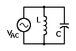
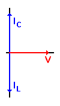
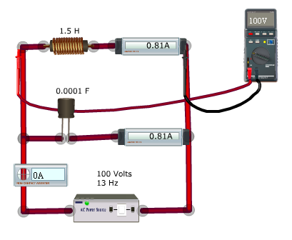

## Theory

  

 

In the schematic diagram shown below, we show a parallel circuit containing an ideal inductance and an ideal capacitance connected in parallel with each other and with an ideal signal voltage source. Thus,

$$V_{AC} = 100 \, \text{vrms}$$

$$f = 10 \, \text{Hz} \quad (\omega = 62.831853 \, \text{rad/sec})$$

$$L = 1.5 \, \text{H} \quad (X_L = 94.2477795 \, \Omega)$$

$$C = 0.0001 \, \text{F} \quad (X_C = 159.1549433 \, \Omega)$$

According to Ohm's Law:

$$i_L = \frac{v_L}{X_L} = \frac{100}{94.2477795} = 1.06032995 \approx 1.06 \, A$$

$$i_C = \frac{v_C}{X_C} = \frac{100}{159.1549433} = 0.62318529 \approx 0.63 \, A$$

  
If we measure the current provided by the source, we find that it is 0.43A — the difference between iL and iC. The question to be asked about this circuit then is, "Where does the extra current in both L and C come from, and where does it go?"

  
  

 

  
The vectors that apply to this circuit give the answer, as shown on the right hand side. Here, the voltage is the same everywhere in a parallel circuit, so we use it as the reference. There is no resistance, so we have no current component in phase with the applied voltage.

  
We already know that current lags voltage by 90° in an inductance, so we draw the vector for iL at -90°. Similarly, we know that current leads voltage by 90° in a capacitance. Therefore, we draw the vector for iC at +90°.

  
Combining these two opposed vectors, we note that the vector sum is in fact the difference between the two vectors. This matches the measured current drawn from the source.

  
The remaining current in L and C represents energy that was obtained from the source when it was first turned on. This energy, and the current it produces, simply gets transferred back and forth between the inductor and the capacitor.

  
If we begin at a voltage peak, C is fully charged. Since current is 90° out of phase with voltage, the current at this instant is zero. But C now discharges through L, causing voltage to decrease as current increases. When C is fully discharged, voltage is zero and current through L is at its peak. This current has caused the magnetic field surrounding L to increase to a maximum value. This completes ¼ cycles.

  
The second quarter-cycle sees the magnetic field collapsing as it tries to maintain the current flowing through L. This current now charges C, but with the opposite polarity from the original charge. As current drops to zero and the voltage on C reaches its peak, the second ¼ cycle is complete.

  
The other half of the cycle sees the same behaviour, except that the current flows through L in the opposite direction, so the magnetic field likewise is in the opposite direction from before. At the conclusion of the second half-cycle, C is once again charged to the same voltage at which it started, with the same polarity. Now, a new cycle begins and repeats the actions of the old one.

  
The calculation for the combined impedance of L and C is the standard product-over-sum calculation for any two impedances in parallel, keeping in mind that we must include our "j" factor to account for the phase shifts in both components. Thus,

$$Z = \frac{(jX_L)(-jX_C)}{(jX_L) + (-jX_C)}$$
$$= \frac{-j^2 (X_L)(X_C)}{j(X_L - X_C)}$$
$$= \frac{-j(X_L)(X_C)}{(X_L - X_C)}$$

This equation tells us two things about the parallel combination of L and C:

The overall phase shift between voltage and current will be governed by the component with the lower reactance. This is reasonable because that will be the component carrying the greater amount of current.

The impedance of the parallel combination can be higher than either reactance alone. This is because of the opposed phase shifts in current through L and C, forcing the denominator of the fraction to be the difference between the two reactance, rather than the sum of them.

Because the denominator specifies the difference between XL and XC, we have an obvious question: What happens if XL = XC — the condition that will exist at the resonant frequency of this circuit? Clearly there's a problem with a zero in the denominator of a fraction, so we need to find out what actually happens in this case.

At the resonant frequency of the parallel LC circuit, we know that XL = XC. At this frequency, according to the equation above, the effective impedance of the LC combination should be infinitely large. In fact, this is indeed the case for this theoretical circuit using theoretically ideal components.

The currents flowing through L and C may be determined by Ohm's Law, as we stated earlier on this page. The current drawn from the source is the difference between iL and iC. However, when XL = XC and the same voltage is applied to both components, their currents are equal as well. Therefore the difference is zero, and no current is drawn from the source. This corresponds to infinite impedance, or an open circuit.

This doesn't mean that no current flows through L and C. Rather, all of the current flowing through these components is simply circulating back and forth between them without involving the source at all. The currents calculated with Ohm's Law still flow through L and C, but remain confined to these two components alone. As a result of this behaviour, the parallel LC circuit is often called a "tank" circuit, because it holds this circulating current without releasing it.

There is one other factor to consider when working with an LC tank circuit: the magnitude of the circulating current. We can use many different values of L and C to set any given resonant frequency. Keep in mind that at resonance:

$$X_L = X_C$$
$$\omega L = \frac{1}{\omega C}$$
$$\omega^2 = \frac{1}{LC}$$

As long as the product L × C remains the same, the resonant frequency is the same. However, if we use a large value of L and a small value of C, their reactance will be high and the amount of current circulating in the tank will be small. If we reverse that and use a low value of L and a high value of C, their reactance will be low and the amount of current circulating in the tank will be much greater. Many applications of this type of circuit depend on the amount of circulating current as well as the resonant frequency, so you need to be aware of this factor. In fact, in real-world circuits that cannot avoid having some resistance (especially in L), it is possible to have such a high circulating current that the energy lost in R (p = i²R) is sufficient to cause L to burn up!

This can be verified using the simulator by creating the above mentioned parallel LC circuit and by measuring the current and voltage across the inductor and capacitor. The values should be consistent with the earlier findings.

<strong>Applications</strong>

The LC circuit behaves as an electronic resonator, which is the key component in many applications.

1. Oscillators
2. Filters
3. Tuners
4. Mixers
5. Foster - Seeley Discriminator
6. Contactless Card
7. Graphics tablets
8. Electronic article surveillance

The Resonant condition in the simulator is depicted below. Resonant frequency = 13 Hz

